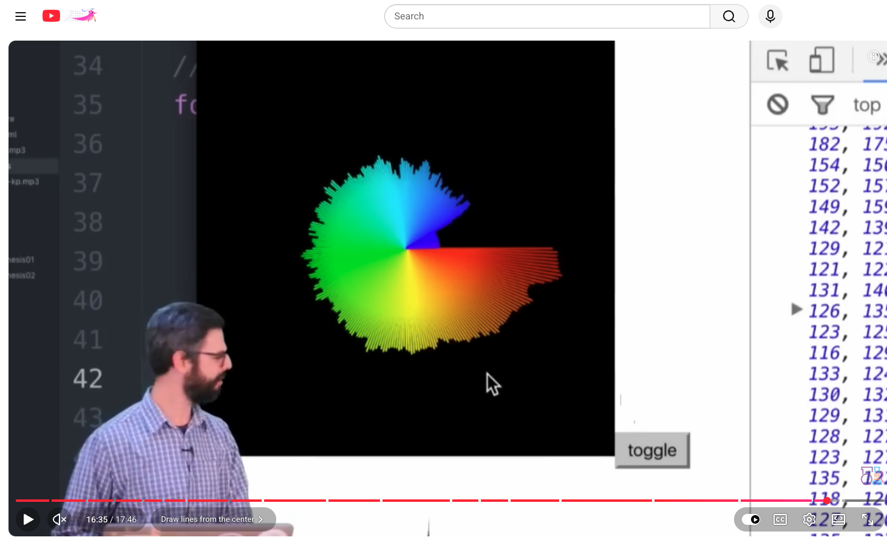
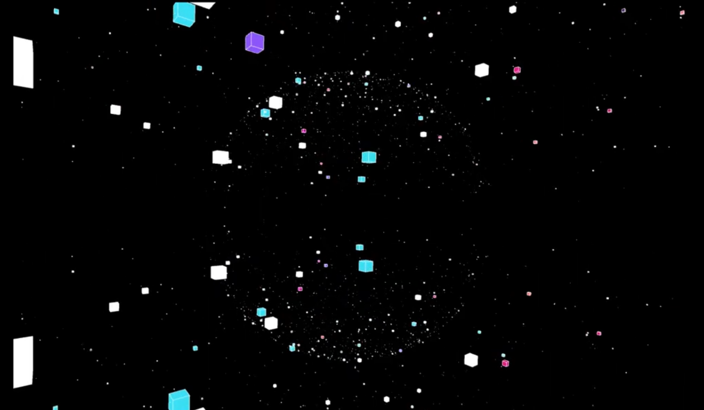

# week-9-quiz-

## Part 1: Imaging Technique Inspiration

For my imaging technique inspiration, I chose audio reactive art work. I was inspired by a piece I found on reddit which takes further than just simple video I would see in 2016 of dance remix having moving spectrum. This art work is moving in a 3D space which i like the idea an think it can go further then simple squares but be addpated into something better.

### Visual References

Reference video/example:  
[Working with FFT using Processing and p5.js](https://www.reddit.com/r/p5js/comments/ym8fek/working_with_fft_using_processing_and_p5_very/)

---

#### Part 2: Coding Technique Exploration

##### Coding Technique: FFT Sound Analysis in p5.js

A coding technique that could help create this effect is using both FFT sound analysis and amplitude analysis in p5.js. The piece before is using both these techniques but the coding train showing how it is used to make a simplier display but the fondamentals will be helpful for the trying to figure the direction in which our grop wants to take the idea

#### Coding Reference

Example demo from the coding train: 
[Working with FFT using Processing and p5.js](https://www.youtube.com/watch?v=2O3nm0Nvbi4)

Example code/reference:  
[p5.js Sound Library: p5.FFT](https://p5js.org/reference/p5.sound/p5.FFT/)